# ATM System Design using State Design Pattern

This project implements a comprehensive ATM system using the State Design Pattern, following SOLID principles.

## Class Diagram

```mermaid
classDiagram
    %% Enums
    class TransactionType {
        <<enumeration>>
        WITHDRAWAL
        DEPOSIT
        BALANCE_INQUIRY
        PIN_CHANGE
        MINI_STATEMENT
    }

    %% Interfaces
    class ATMState {
        <<interface>>
        +insertCard(ATMOrchestrator, Card) void
        +enterPin(ATMOrchestrator, String) void
        +selectTransaction(ATMOrchestrator, TransactionType) void
        +enterAmount(ATMOrchestrator, double) void
        +dispenseCash(ATMOrchestrator) void
        +ejectCard(ATMOrchestrator) void
        +printReceipt(ATMOrchestrator) void
        +cancel(ATMOrchestrator) void
    }

    class BankService {
        <<interface>>
        +validatePin(Card, String) boolean
        +getAccountBalance(Card) double
        +withdraw(Card, double) boolean
        +deposit(Card, double) boolean
        +changePin(Card, String) boolean
        +getMiniStatement(Card, int) List~Transaction~
        +generateTransactionId() String
    }

    %% Core Model Classes
    class Card {
        -cardNumber String
        -pin String
        -bankId String
        -accountNumber String
        -isBlocked boolean
        +Card(String, String, String, String)
        +getCardNumber() String
        +getPin() String
        +setPin(String) void
        +getBankId() String
        +getAccountNumber() String
        +isBlocked() boolean
        +setBlocked(boolean) void
    }

    class Transaction {
        -transactionId String
        -accountNumber String
        -type TransactionType
        -amount double
        -timestamp LocalDateTime
        -description String
        -balanceAfter double
        +Transaction(String, String, TransactionType, double, String, double)
        +getTransactionId() String
        +getAccountNumber() String
        +getType() TransactionType
        +getAmount() double
        +getTimestamp() LocalDateTime
        +getDescription() String
        +getBalanceAfter() double
    }

    class ATMOrchestrator {
        -currentState ATMState
        -currentCard Card
        -atmId String
        -bankServiceManager BankServiceManager
        -cashDispenser CashDispenser
        -receiptPrinter ReceiptPrinter
        -transactionAmount double
        -selectedTransaction TransactionType
        -pinAttempts int
        +ATMOrchestrator(String)
        +ATMOrchestrator(String, DispensingStrategy)
        +setState(ATMState) void
        +getCurrentState() ATMState
        +insertCard(Card) void
        +enterPin(String) void
        +selectTransaction(TransactionType) void
        +enterAmount(double) void
        +dispenseCash() void
        +ejectCard() void
        +printReceipt() void
        +cancel() void
        +getCurrentCard() Card
        +setCurrentCard(Card) void
        +getAtmId() String
        +getBankServiceManager() BankServiceManager
        +getCashDispenser() CashDispenser
        +getReceiptPrinter() ReceiptPrinter
        +getTransactionAmount() double
        +setTransactionAmount(double) void
        +getSelectedTransaction() TransactionType
        +setSelectedTransaction(TransactionType) void
        +getPinAttempts() int
        +incrementPinAttempts() void
        +resetPinAttempts() void
        +hasExceededPinAttempts() boolean
        +reset() void
    }

    class DispensingStrategy {
        <<interface>>
        +dispenseCash(int, Map) Map~Integer_Integer~
        +getStrategyName() String
    }

    class CashDispenser {
        -cashInventory Map~Integer_Integer~
        -dispensingStrategy DispensingStrategy
        -denominations int[]
        +CashDispenser(DispensingStrategy)
        +canDispense(double) boolean
        +dispenseCash(double) Map~Integer_Integer~
        +setDispensingStrategy(DispensingStrategy) void
        +getDispensingStrategy() DispensingStrategy
        +getCurrentStrategyName() String
        +addCash(int, int) void
        +getCashInventory() Map~Integer_Integer~
    }

    class MinimumNotesStrategy {
        -denominations int[]
        +dispenseCash(int, Map) Map~Integer_Integer~
        +getStrategyName() String
    }


    class ReceiptPrinter {
        -paperAvailable boolean
        +ReceiptPrinter()
        +printTransactionReceipt(Transaction, String) void
        +printMiniStatement(List~Transaction~, String, double) void
        +printBalanceReceipt(double, String, String) void
        +isPaperAvailable() boolean
        +setPaperAvailable(boolean) void
    }

    %% State Implementations
    class IdleState {
        +insertCard(ATMOrchestrator, Card) void
        +enterPin(ATMOrchestrator, String) void
        +selectTransaction(ATMOrchestrator, TransactionType) void
        +enterAmount(ATMOrchestrator, double) void
        +dispenseCash(ATMOrchestrator) void
        +ejectCard(ATMOrchestrator) void
        +printReceipt(ATMOrchestrator) void
        +cancel(ATMOrchestrator) void
    }

    class PinValidationState {
        +insertCard(ATMOrchestrator, Card) void
        +enterPin(ATMOrchestrator, String) void
        +selectTransaction(ATMOrchestrator, TransactionType) void
        +enterAmount(ATMOrchestrator, double) void
        +dispenseCash(ATMOrchestrator) void
        +ejectCard(ATMOrchestrator) void
        +printReceipt(ATMOrchestrator) void
        +cancel(ATMOrchestrator) void
    }

    class TransactionMenuState {
        +insertCard(ATMOrchestrator, Card) void
        +enterPin(ATMOrchestrator, String) void
        +selectTransaction(ATMOrchestrator, TransactionType) void
        +enterAmount(ATMOrchestrator, double) void
        +dispenseCash(ATMOrchestrator) void
        +ejectCard(ATMOrchestrator) void
        +printReceipt(ATMOrchestrator) void
        +cancel(ATMOrchestrator) void
    }

    class WithdrawalState {
        +insertCard(ATMOrchestrator, Card) void
        +enterPin(ATMOrchestrator, String) void
        +selectTransaction(ATMOrchestrator, TransactionType) void
        +enterAmount(ATMOrchestrator, double) void
        +dispenseCash(ATMOrchestrator) void
        +ejectCard(ATMOrchestrator) void
        +printReceipt(ATMOrchestrator) void
        +cancel(ATMOrchestrator) void
    }

    class DepositState {
        +insertCard(ATMOrchestrator, Card) void
        +enterPin(ATMOrchestrator, String) void
        +selectTransaction(ATMOrchestrator, TransactionType) void
        +enterAmount(ATMOrchestrator, double) void
        +dispenseCash(ATMOrchestrator) void
        +ejectCard(ATMOrchestrator) void
        +printReceipt(ATMOrchestrator) void
        +cancel(ATMOrchestrator) void
    }

    class BalanceInquiryState {
        +insertCard(ATMOrchestrator, Card) void
        +enterPin(ATMOrchestrator, String) void
        +selectTransaction(ATMOrchestrator, TransactionType) void
        +enterAmount(ATMOrchestrator, double) void
        +dispenseCash(ATMOrchestrator) void
        +ejectCard(ATMOrchestrator) void
        +printReceipt(ATMOrchestrator) void
        +cancel(ATMOrchestrator) void
    }

    class PinChangeState {
        +insertCard(ATMOrchestrator, Card) void
        +enterPin(ATMOrchestrator, String) void
        +selectTransaction(ATMOrchestrator, TransactionType) void
        +enterAmount(ATMOrchestrator, double) void
        +dispenseCash(ATMOrchestrator) void
        +ejectCard(ATMOrchestrator) void
        +printReceipt(ATMOrchestrator) void
        +cancel(ATMOrchestrator) void
    }

    class MiniStatementState {
        +insertCard(ATMOrchestrator, Card) void
        +enterPin(ATMOrchestrator, String) void
        +selectTransaction(ATMOrchestrator, TransactionType) void
        +enterAmount(ATMOrchestrator, double) void
        +dispenseCash(ATMOrchestrator) void
        +ejectCard(ATMOrchestrator) void
        +printReceipt(ATMOrchestrator) void
        +cancel(ATMOrchestrator) void
    }

    class TransactionCompleteState {
        +insertCard(ATMOrchestrator, Card) void
        +enterPin(ATMOrchestrator, String) void
        +selectTransaction(ATMOrchestrator, TransactionType) void
        +enterAmount(ATMOrchestrator, double) void
        +dispenseCash(ATMOrchestrator) void
        +ejectCard(ATMOrchestrator) void
        +printReceipt(ATMOrchestrator) void
        +cancel(ATMOrchestrator) void
    }

    class CardEjectionState {
        +insertCard(ATMOrchestrator, Card) void
        +enterPin(ATMOrchestrator, String) void
        +selectTransaction(ATMOrchestrator, TransactionType) void
        +enterAmount(ATMOrchestrator, double) void
        +dispenseCash(ATMOrchestrator) void
        +ejectCard(ATMOrchestrator) void
        +printReceipt(ATMOrchestrator) void
        +cancel(ATMOrchestrator) void
    }

    %% Service Implementation
    class BankServiceImpl {
        -accountBalances Map~String_Double~
        -transactionHistory Map~String_List~Transaction~~
        -transactionCounter int
        -bankId String
        +BankServiceImpl(String)
        +getBankId() String
        +validatePin(Card, String) boolean
        +getAccountBalance(Card) double
        +withdraw(Card, double) boolean
        +deposit(Card, double) boolean
        +changePin(Card, String) boolean
        +getMiniStatement(Card, int) List~Transaction~
        +generateTransactionId() String
        +addAccount(String, String, String, double) void
    }

    class BankServiceManager {
        -bankServices Map~String_BankService~
        -instance BankServiceManager
        +getInstance() BankServiceManager
        +getBankService(String) BankService
        +validatePin(Card, String) boolean
        +getAccountBalance(Card) double
        +withdraw(Card, double) boolean
        +deposit(Card, double) boolean
        +changePin(Card, String) boolean
        +getMiniStatement(Card, int) List~Transaction~
        +generateTransactionId() String
        +addBankService(String, BankService) void
        +isBankSupported(String) boolean
    }

    %% Demo
    class ATMDemo {
        +main(String[]) void
    }

    %% Relationships
    IdleState ..|> ATMState
    PinValidationState ..|> ATMState
    TransactionMenuState ..|> ATMState
    WithdrawalState ..|> ATMState
    DepositState ..|> ATMState
    BalanceInquiryState ..|> ATMState
    PinChangeState ..|> ATMState
    MiniStatementState ..|> ATMState
    TransactionCompleteState ..|> ATMState
    CardEjectionState ..|> ATMState

    BankServiceImpl ..|> BankService

    MinimumNotesStrategy ..|> DispensingStrategy

    ATMOrchestrator *-- ATMState
    ATMOrchestrator *-- Card
    ATMOrchestrator *-- BankServiceManager
    ATMOrchestrator *-- CashDispenser
    ATMOrchestrator *-- ReceiptPrinter
    ATMOrchestrator --> TransactionType

    CashDispenser *-- DispensingStrategy

    BankServiceManager *-- BankService
    BankServiceManager --> Transaction

    Transaction --> TransactionType
    Card --> TransactionType

    ATMDemo --> ATMOrchestrator
    ATMDemo --> Card

    ReceiptPrinter --> Transaction
    BankServiceImpl --> Transaction
```



## Features

- **Card Reader**: Accepts and validates cards
- **PIN Validation**: Secure PIN entry with attempt limits
- **Cash Dispenser**: Dispenses cash with minimum currency mode
- **Deposit System**: Handles cash deposits
- **Receipt Printer**: Prints transaction receipts and mini statements
- **Balance Inquiry**: Shows account balance
- **PIN Change**: Allows users to change their PIN
- **Mini Statement**: Shows recent transaction history
- **Multi-Bank Support**: Internal routing to different bank services based on card bank ID

## Design Patterns Used

### State Design Pattern
The system uses the State Design Pattern to manage different ATM states:
- `IdleState`: Waiting for card insertion
- `PinValidationState`: Validating user PIN
- `TransactionMenuState`: Showing transaction options
- `WithdrawalState`: Processing cash withdrawal
- `DepositState`: Processing cash deposit
- `BalanceInquiryState`: Showing balance information
- `PinChangeState`: Changing user PIN
- `MiniStatementState`: Printing mini statements
- `TransactionCompleteState`: Transaction completed
- `CardEjectionState`: Ejecting card

### Strategy Design Pattern
The system uses the Strategy Design Pattern for cash dispensing algorithms:
- `MinimumNotesStrategy`: Uses the fewest number of notes 
- Strategies can be changed at runtime for different dispensing behaviors

## Project Structure

- `ATMState.java` - State interface defining all possible actions
- `ATMOrchestrator.java` - Orchestrator class managing state transitions and components
- `Card.java` - Card entity
- `Transaction.java` - Transaction entity
- `TransactionType.java` - Transaction type enumeration
- `BankService.java` - Bank service interface
- `BankServiceImpl.java` - Bank service implementation
- `BankServiceManager.java` - Manages multiple bank services and routing
- `CashDispenser.java` - Cash dispensing functionality with strategy pattern
- `DispensingStrategy.java` - Strategy interface for cash dispensing algorithms
- `MinimumNotesStrategy.java` - Minimum notes dispensing strategy
- `ReceiptPrinter.java` - Receipt and statement printing
- State implementations: `IdleState.java`, `PinValidationState.java`, etc.
- `ATMDemo.java` - Main demo application

## How to Run

1. Compile all Java files:
   ```bash
   javac *.java
   ```

2. Run the ATM demo:
   ```bash
   java ATMDemo
   ```
